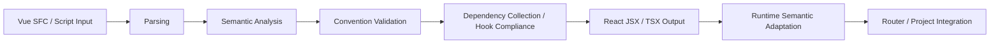

<div align="center"><a name="readme-top"></a>

 

 <h1>VuReact</h1>

**Write Vue. Get Pure React.**

> A smart compiler built for migrating Vue to React.
>
> Converts Vue 3 Components, Scripts, and Styles into pure React (no runtime bridge),
> supporting progressive migration and Vue+React hybrid development.

[](https://vureact.top/en/)
[](https://github.com/vureact-js/core/stargazers)
[](https://www.npmjs.com/package/@vureact/compiler-core)
[](https://www.npmjs.com/package/@vureact/compiler-core)
[](https://codecov.io/gh/vureact-js/core)
[](https://nodejs.org/)
[](https://github.com/vureact-js/core/blob/master/LICENSE)
[](https://vuejs.org/)
[](https://reactjs.org/)

[Online Playground](#️-online-playground-no-install) · [Quick Start](#-quick-start) · [Use Cases](#-use-cases) · [Ecosystem](#️-ecosystem) · [Compilation Conventions](https://vureact.top/en/guide/specification.html) · [Semantic Comparison](https://vureact.top/en/guide/semantic-comparison/overview.html) · [Changelog](https://vureact.top/en/guide/changelog.html)

English | [简体中文](./README.md) | [日本語](./README.ja.md)

  <a href="assets/vureact-showcase(3.7MB).mp4" title="Watch Showcase Video">
    
  </a>

  Showcase (Vue project on left → generated React app on right)

  [Watch Showcase Video](assets/vureact-showcase(3.7MB).mp4) · [View High-Resolution GIF](assets/vureact-showcase(1280x720).gif)
</div>

## 💡 Why VuReact?

Existing solutions either wrap a runtime (bad perf, harder debugging) or provide partial conversions that fail on advanced syntax. VuReact is a compile-time approach: output is plain React code with no Vue runtime dependency, enabling progressive migration.

| Other Approaches | VuReact |
|---|---|
| Runtime wrappers (dual frameworks, poor performance, large bundles) | Compile-time output — pure React, incremental, per-module migration |
| Partial converters (fail on complex syntax) | Full support for template directives, props, slots, Composition API, scoped styles, and TypeScript typings |
| AI-based rewrites (unpredictable, require heavy manual review) | Deterministic AST-based transforms — predictable and auditable output |

👉 **Learn more:** [Why VuReact? — more than syntax transformation](https://vureact.top/en/guide/why.html)

---

## 📖 Table of Contents

- [🕹️ Online Playground (no install)](#️-online-playground-no-install)
- [✨ Core Features](#-core-features)
- [🚀 Quick Start](#-quick-start)
- [🛠️ CLI](#️-cli)
- [💬 Feedback & Community](#-feedback--community)
- [✅ Use Cases](#-use-cases)
- [📦 Repository Packages](#-repository-packages)
- [♻️ Ecosystem](#️-ecosystem)
- [⚙️ Processing Flow](#️-processing-flow)
- [🙏 Special Thanks](#-special-thanks)
- [🤝 Contributing](#-contributing)
- [📄 License](#-license)
- [🩷 Sponsorship](#-sponsorship)
- [🧩 Who's using VuReact](#-whos-using-vureact)

---

## 🕹️ Online Playground (no install)

Try the full Vue → React compilation flow in 30 seconds:

- [Customer Support Hub (mixed-example)](https://codesandbox.io/p/github/vureact-js/example-customer-support-hub/master?import=true)
- [CRM Admin Backend (standard example)](https://codesandbox.io/p/github/vureact-js/example-crm-admin-backend/master)

> Examples are hosted on CodeSandbox and start automatically — please allow a moment to load.

---

## ✨ Core Features

- **Semantic, not string-based transforms:** analyzes templates, `<script setup>`, Composition API and TS types to generate idiomatic React code.
- **Convention-first, controllable & maintainable:** not trying to convert everything — follows explicit compilation rules for predictable output.
- **Incremental migration:** convert single files or whole projects progressively, no full rewrite required.
- **Comprehensive feature adaptation:** reactive APIs, lifecycle, built-ins, routing, scoped/module styles, Less/Sass handled at compile time with zero runtime overhead.
- **Automatic dependency inference:** top-level functions are automatically wrapped with `useCallback`, objects/values are memoized via `useMemo`, and hook dependencies are tracked.
- **Dual-mode CLI:** `vureact build` (fast incremental builds) and `vureact watch` (watch mode) for a near-native developer experience.

---

## 🚀 Quick Start

> 💡 **Official guide from scratch:** [VuReact Quick Start](https://vureact.top/en/guide/quick-start.html)
>
> 💡 **Hybrid migration walkthrough:** [Customer Support Hub (Vue + React)](https://vureact.top/en/guide/customer-support-hub)

### Install

In your Vue 3 project, install:

```bash
npm i -D @vureact/compiler-core
```

### Create a config file

Create `vureact.config.ts` in the project root:

```ts
import { defineConfig } from '@vureact/compiler-core';
export default defineConfig({
  input: '', // input path: single file or directory
  exclude: ['src/main.ts'], // exclude the Vue entry and files that should not be compiled
  output: {
    workspace: '.vureact',
    outDir: 'react-app',
    bootstrapVite: true,
  },
  onSuccess: async () => {
    console.log('Compilation succeeded!');
    // You can do extra work here, such as filesystem changes or calling other tools
  },
});
```

> 💡 More configuration options: [Config API](https://vureact.top/en/api/config.html)

### Convert a single Vue component

```ts
{
 input: './src/your-component.vue',
}
```

### Convert a whole project

```ts
{
 input: './src',
}
```

> 💡 Note: if your project uses Vue Router, see the [router adaptation guide](https://vureact.top/en/guide/router-adaptation.html) for the required setup.

### Run the compiler

```bash
npx vureact build
```

The generated `.vureact/react-app` directory contains the converted components and the related dependency/config setup.

Project layout example:

```txt
vue-project/
├── .vureact/
│   ├── cache/             # compilation cache
│   ├── react-app/         # generated React app
│   │   ├── src/           # converted React source
│   │   ├── package.json   # React app dependencies
│   │   ├── vite.config.ts # Vite config
│   │
├── src/                   # original Vue source
├── package.json           # original project dependencies
└── vureact.config.ts      # config file
```

> 💡 If you see compilation warnings, follow the hints and adjust your source. Reading the [Compilation Conventions](https://vureact.top/en/guide/specification.html) and [Best Practices](https://vureact.top/en/guide/best-practices.html) will help you write Vue code that converts more smoothly.

---

## 🛠️ CLI

```bash
# full/incremental build
npx vureact build

# watch mode for development
npx vureact watch

# show version
npx vureact -v

# help
npx vureact --help
```

👉 See the build/watch guides: [Incremental Compilation](https://vureact.top/en/guide/incremental-compilation.html) | [Watch Mode](https://vureact.top/en/guide/watch-mode.html)

---

## 💬 Feedback & Community

- Problems? See the [FAQ](https://vureact.top/en/guide/faq.html) or open an [Issue](https://github.com/vureact-js/core/issues).
- Questions about router adaptation? See the [router adaptation guide](https://vureact.top/en/guide/router-adaptation.html).
- Page styles look wrong? See the [style troubleshooting solution](https://vureact.top/en/guide/faq.html#q35-how-to-fix-missing-or-broken-page-styles).
- Share your experience on [Discussions](https://github.com/vureact-js/core/discussions).
- Want to support the project? A ⭐ helps more people discover it.

---

## ✅ Use Cases

### Recommended

- Projects need to migrate incrementally from Vue 3 to React, but do not want to rewrite from scratch, preferring to find existing solutions first.
- Some developers use Vue as their primary technology stack, are accustomed to its mental model, and consider React's overhead to be heavier than Vue's.
- Backend developers do not want to learn both frameworks; Vue is quick to pick up and intuitive, and they are reluctant to engage with React.
- The converted React code must completely detach from the Vue runtime to avoid performance and bundle size issues caused by a dual-framework runtime.

### Caveats

- **Controllability first:** current focus is engineering scenarios prioritizing predictability.
- **Convention-driven:** [compilation relies](https://vureact.top/en/guide/specification.html) on clear conventions.
- **Modern syntax:** targets Vue 3 Composition API and `<script setup>`.

> Optionally, use [Hybrid Authoring](https://vureact.top/en/guide/mind-control-readme.html) to leverage React ecosystem capabilities within a Vue project.

---

## 📦 Repository Packages

- [packages/compiler-core](./packages/compiler-core/)
- [packages/runtime-core](./packages/runtime-core/)

---

## ♻️ Ecosystem

- **[VuReact Runtime](https://runtime.vureact.top/en)** — lightweight React-side implementations of Vue core APIs.
- **[VuReact Router](https://router.vureact.top/en)** — adapter layer that maps Vue Router patterns to React Router.

---

## ⚙️ Processing Flow

VuReact's processing flow is divided into two main stages: compilation and runtime, achieving the conversion from Vue to React through clear division of labor.



**Compilation (Deterministic)**: Parse Vue SFC / Script, validate conventions, analyze dependencies, and generate TSX that closely follows React practices.

**Runtime (Semantic Adaptation)**: Provide Vue-style APIs (such as `useVRef`, `KeepAlive` and etc.), fill in framework discrepancies that the compiler cannot resolve, and integrate the routing layer to ensure the migration covers the entire project.

👉 **Learn more:** [VuReact Philosophy](https://vureact.top/en/guide/philosophy.html)

---

## 🙏 Special Thanks

The runtime adaptation layer was inspired and supported by the following projects:

- [valtio](https://github.com/pmndrs/valtio) — Vue-style reactive API ideas and Proxy-based implementation on the React side
- [react-transition-group](https://github.com/reactjs/react-transition-group#readme) — React transition animation components

---

## 🤝 Contributing

Contributions welcome — please read [CONTRIBUTING.md](CONTRIBUTING.md).

---

## 📄 License

MIT License © 2025 [Ruihong Zhong (Ryan John)](./LICENSE)

---

## 🩷 Sponsorship

VuReact is community-supported. Sponsorships fund maintenance, feature work and docs.

Platform: [Afdian](https://afdian.com/a/vureact-js/plan)

---

## 🧩 Who's using VuReact

We are collecting the first showcase entries — if you tried VuReact, please submit a case:

- [Submit a showcase](https://github.com/vureact-js/core/issues/new?template=showcase.md&title=%5BSHOWCASE%5D%20)
- [See submitted showcases](https://github.com/vureact-js/core/issues?q=is%3Aissue%20label%3Ashowcase)

---

*VuReact — exploring the feasibility of full Vue-to-React compilation through an innovative compiler architecture and runtime adaptation, aiming for unprecedented transformation depth and engineering completeness.*
