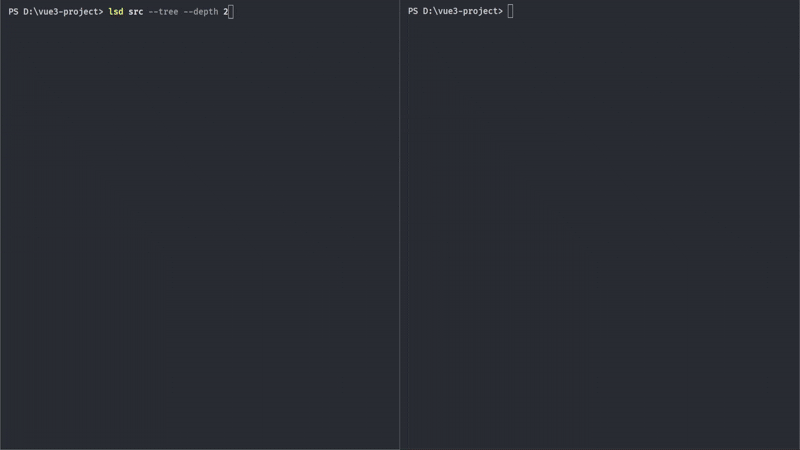
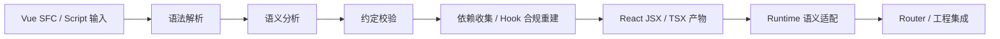

<div align="center"><a name="readme-top"></a>

  

  <h1>VuReact</h1>

**写 Vue，输出可维护的 React。**

> 一套面向 Vue 迁移 React 与混合开发的完整解决方案。
>
> 将 Vue 3 SFCs・Scripts・Styles 完整转为纯 React（非运行时桥接），
> 覆盖 `<script setup>` 核心全特性，支持渐进式迁移与混合开发。

[](https://vureact.top/)
[](https://github.com/vureact-js/core/stargazers)
[](https://www.npmjs.com/package/@vureact/compiler-core)
[](https://www.npmjs.com/package/@vureact/compiler-core)
[](https://codecov.io/gh/vureact-js/core)
[](https://nodejs.org/)
[](https://github.com/vureact-js/core/blob/master/LICENSE)
[](https://vuejs.org/)
[](https://reactjs.org/)

[在线体验](#️-在线体验无需安装) · [快速开始](#-快速开始) · [适用场景](#-适用场景) · [生态集成](#️-生态集成) · [编译约定](https://vureact.top/guide/specification.html) · [转换对照](https://vureact.top/guide/semantic-comparison/overview.html) · [更新日志](https://vureact.top/guide/changelog.html)

简体中文 | [English](./README.en.md) | [日本語](./README.ja.md)

  <a href="assets/vureact-showcase(3.7MB).mp4" title="观看展示视频">
    
  </a>

  演示效果（左 Vue 项目 → 右生成 React 应用）
  
  [观看展示视频](assets/vureact-showcase(3.7MB).mp4) · [查看高清动图](assets/vureact-showcase(1280x720).gif)
</div>

## 💡 为什么选 VuReact?

其他方案要么是运行时套壳（性能差、调试难），要么是半成品转换（复杂语法就报错）。VuReact 是编译时方案，产物是纯 React 代码，没有 Vue 运行时，支持渐进迁移。

| 其他方案 | VuReact |
|----------|---------|
| 运行时套壳（双框架，性能差，包体大） | 编译时，产物纯 React，可渐进迁移，逐模块编译 |
| 半成品转换（复杂语法报错） | 完整模板指令、Props、插槽、Composition API、scoped 样式、 TS 类型定义等 |
| AI 改写（结果不确定，代码基于猜测，需人工二次审核） | 确定性编译，基于 AST 静态转换，结果可预测、可追溯 |

👉 **深入了解请访问：**[为什么选择 VuReact？—— 不止是语法转换](https://vureact.top/guide/why.html)

---

## 📖 目录

- [🕹️ 在线体验（无需安装）](#️-在线体验无需安装)
- [✨ 核心特性](#-核心特性)
- [🚀 快速开始](#-快速开始)
- [🛠️ CLI 命令](#️-cli-命令)
- [💬 反馈与交流](#-反馈与交流)
- [✅ 适用场景](#-适用场景)
- [📦 仓库子包](#-仓库子包)
- [♻️ 生态集成](#️-生态集成)
- [⚙️ 处理流程](#️-处理流程)
- [🙏 特别鸣谢](#-特别鸣谢)
- [🤝 贡献](#-贡献)
- [📄 许可证](#-许可证)
- [🩷 赞助](#-赞助)
- [🧩 谁在用](#-谁在用)

---

## 🕹️ 在线体验（无需安装）

**30 秒体验 Vue → React 完整编译流程：**

- [客户支持后台（混写示例）](https://codesandbox.io/p/github/vureact-js/example-customer-support-hub/master?import=true)
- [CRM 管理后台（标准示例）](https://codesandbox.io/p/github/vureact-js/example-crm-admin-backend/master)

> 💡 示例均托管至 CodeSandbox，打开后自动运行，请耐心等待一会！

---

## ✨ 核心特性

- **🧠 语义级编译，不是字符替换**：分析模板、`<script setup>`、组合式 API、TS 类型等完整语义，生成符合 React 习惯的代码。
- **🎯 约定优先，可控可维护**：不追求“什么都能转”，基于明确的编译约定，确保转换结果可预测、可分析。
- **📦 渐进迁移**：从单文件到整个项目逐步推进，不需要一次性重写。
- **⚛️ 完整特性适配**：响应式 API、生命周期、内置组件、路由等 Vue 核心特性完整适配到 React；`scoped`/`module` 样式和 Less/Sass 均在编译阶段处理，零运行时开销。
- **⚡ 自动依赖分析**：顶层函数自动注入 `useCallback`，变量声明自动注入 `useMemo`，hooks 依赖自动追踪。
- **🛠️ 双模式 CLI**：`vureact build`（极速增量编译）+ `vureact watch`（文件监听），开发体验接近原生。

---

## 🚀 快速开始

> 💡 **从零开始的官方指南：**[VuReact 快速入门](https://vureact.top/guide/quick-start.html)
>
> 💡 **混合项目迁移实践：**[客户支持协同后台（Vue + React）](https://vureact.top/guide/customer-support-hub)

### 安装

在你的 **Vue 3 项目**下，选择任意方式安装：

```bash
npm i -D @vureact/compiler-core
```

### 创建配置文件

在项目根目录下，创建 `vureact.config.ts` 文件：

```ts
import { defineConfig } from '@vureact/compiler-core';
export default defineConfig({
 input: '', // 输入路径，支持单文件或目录
 exclude: ['src/main.ts'], // 排除 Vue 入口与不参与编译的文件
 output: {
   workspace: '.vureact',
   outDir: 'react-app',
   bootstrapVite: true,
 },
 onSuccess: async () => {
   console.log('编译成功！');
   // 这里可以执行额外的操作，比如操作文件系统、调用其他工具等
 },  
});
```

> 💡 更多配置项详见： [配置 API](https://vureact.top/api/config.html)

### 1️⃣ 转换单个 Vue 组件

```ts
{
  // 单 SFC 试点，需使用 <script setup>
  input: './src/your-component.vue',
}
```

### 2️⃣ 转换整个项目

```ts
{
  // 支持多级目录递归，输入任意目录即可
  // 注意：所有组件必须使用 <script setup>（否则会报错）
  input: './src', 
}
```

> 💡 注意：若项目使用了 Vue Router，请查看 [路由适配指南](https://vureact.top/guide/router-adaptation.html) 进行配置。

### 🤖 执行编译转换

```bash
npx vureact build
```

自动生成的 `.vureact/react-app` 目录里，包含了转换后的组件和相关依赖配置等。

项目结构大致示例：

```txt
vue-project/
├── .vureact/              # 工作区（编译生成）
│   ├── cache/             # 编译缓存
│   ├── react-app/         # 转换后的 React 工程
│   │   ├── src/           # 转换后的 React 代码
│   │   ├── package.json   # React 项目依赖
│   │   ├── vite.config.ts # Vite 配置
│   │
├── src/                   # 原始 Vue 代码
├── package.json           # 原始项目依赖
└── vureact.config.ts      # 配置文件
```

> 💡 若出现编译告警，请按提示修改。阅读 [编译约定](https://vureact.top/guide/specification.html) | [最佳实践](https://vureact.top/guide/best-practices.html) 有助于你写出更适合转换的 Vue 代码。

---

## 🛠️ CLI 命令

```bash
# 全量/增量编译
npx vureact build

# 开发模式，监听文件变化自动编译
npx vureact watch

# 查看版本
npx vureact -v

# 查看帮助
npx vureact --help
```

👉 **build/watch 指南详见：**[Build 增量编译](https://vureact.top/guide/incremental-compilation.html) | [Watch 监听模式](https://vureact.top/guide/watch-mode.html)

---

## 💬 反馈与交流

- 遇到问题？[查看 FAQ](https://vureact.top/guide/faq.html) 或 [提交 Issue](https://github.com/vureact-js/core/issues)
- 路由适配有疑问？[查看路由适配指南](https://vureact.top/guide/router-adaptation.html)
- 页面样式异常？[查看解决方案](https://vureact.top/guide/faq.html#q35-页面样式异常或丢失如何解决)
- 使用感受？来 [Discussions](https://github.com/vureact-js/core/discussions) 聊聊
- 想支持我们？点个 ⭐ 让更多人看到这个项目

---

## ✅ 适用场景

### 推荐使用

- 项目需从 Vue 3 渐进式迁移到 React，但不想从头重写，优先寻找现有解决方案
- 部分开发者以 Vue 为主技术栈，习惯其心智模型，认为 React 的额外负担比 Vue 更重
- 后端开发者不想学习双框架，Vue 上手快、符合直觉，不愿接触 React
- 转换后的 React 需完全脱离 Vue 运行时，避免双框架运行时所带来的性能和体积问题

### 注意事项

- **优先可控**：服务于可控工程场景
- **约定驱动**：需要遵守明确的[编译约定](https://vureact.top/guide/specification.html)
- **现代语法**：专注于 Vue 3 Composition API 与 `<script setup>`

> 可选 [☣️混合编写](https://vureact.top/guide/mind-control-readme.html)，Vue 项目直接引入 React 生态能力。

---

## 📦 仓库子包

- [packages/compiler-core](./packages/compiler-core/)
- [packages/runtime-core](./packages/runtime-core/)

---

## ♻️ 生态集成

- **[VuReact Runtime](https://runtime.vureact.top)**：提供轻量级 React 版的 Vue 核心组件 & API
- **[VuReact Router](https://router.vureact.top)**：基于 React Router DOM 的 Vue Router 风格适配层

---

## ⚙️ 处理流程

VuReact 的处理流程分为编译时和运行时两个主要阶段，通过清晰的分工实现从 Vue 到 React 的转换。



**编译时（确定性）**：解析 Vue SFC / Script、校验约定、分析依赖，生成贴近 React 实践的 TSX。

**运行时（语义适配）**：提供 Vue 风格 API（如 `useVRef`、`KeepAlive` 等），补齐编译无法抹平的框架差异，并集成路由层，确保迁移覆盖完整工程。

👉 **深入了解请访问：**[VuReact 设计理念](https://vureact.top/guide/philosophy.html)

---

## 🙏 特别鸣谢

Runtime 适配层的开发得到了以下项目的启发和支持：

- [valtio](https://github.com/pmndrs/valtio) — React 的 Vue 风格响应式 API 和 Proxy 实现
- [react-transition-group](https://github.com/reactjs/react-transition-group#readme) — React 过渡动画组件

---

## 🤝 贡献

欢迎提交 Issue 和 Pull Request！请先阅读 [贡献指南](CONTRIBUTING.zh.md)。

---

## 📄 许可证

MIT License © 2025 [Ruihong Zhong (Ryan John)](./LICENSE)

---

## 🩷 赞助

**VuReact 的持续发展离不开社区的支持，您的赞助将直接用于项目维护、功能开发和文档完善，帮助我们共同探索 Vue 到 React 编译的技术边界。**

平台：[爱发电](https://afdian.com/a/vureact-js/plan)

---

## 🧩 谁在用

第一个使用案例正在征集中，如果你试用了 VuReact，欢迎告诉我们！你可以通过 Issue 模板提交案例：

- [提交「谁在用」案例](https://github.com/vureact-js/core/issues/new?template=showcase.zh-CN.md&title=%5BSHOWCASE%5D%20)
- [查看已提交案例](https://github.com/vureact-js/core/issues?q=is%3Aissue%20label%3Ashowcase)

我们会定期从这些案例中整理出适合公开展示的条目。

---

*VuReact - 验证"Vue 到 React 完整编译"这一长期技术设想的可行性，通过创新的编译架构和运行时适配，实现前所未有的转换深度和工程完整性。*
